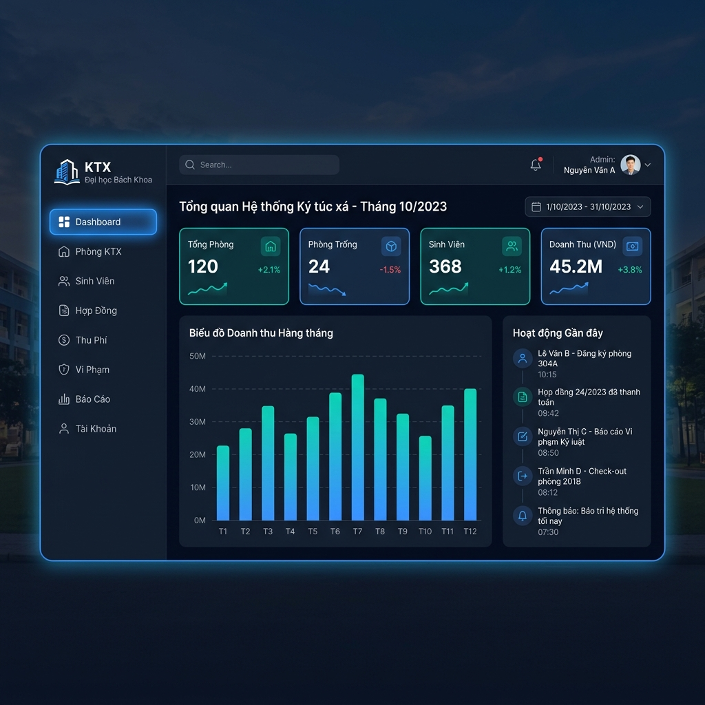
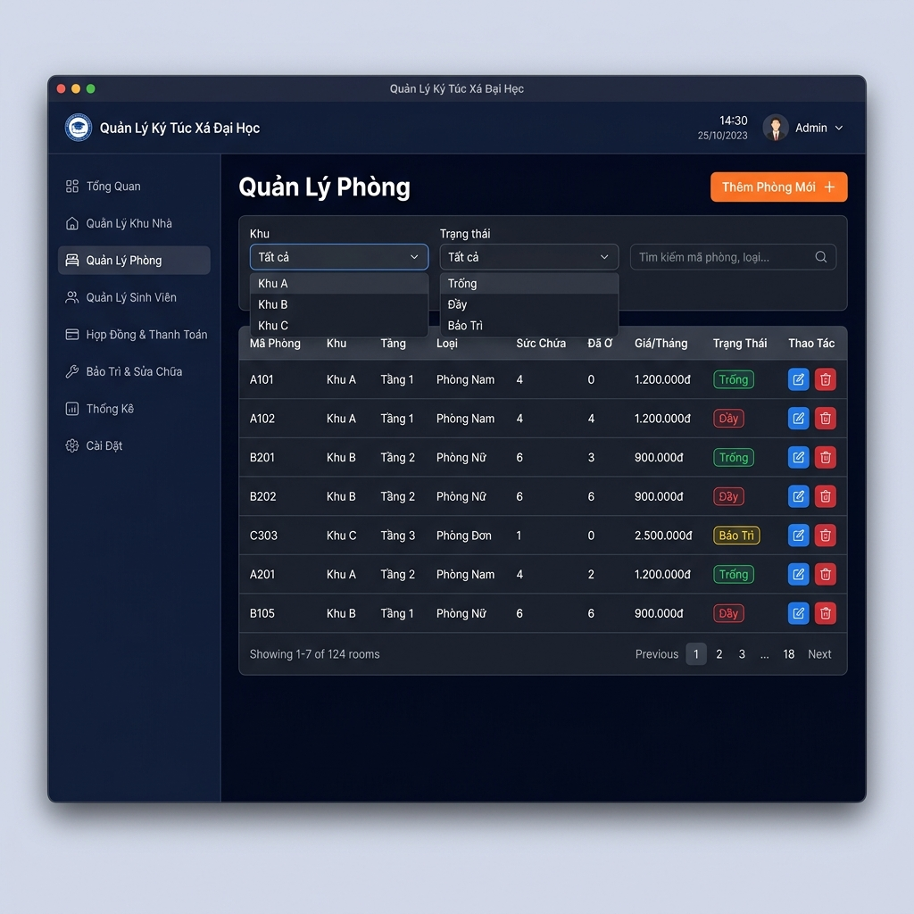
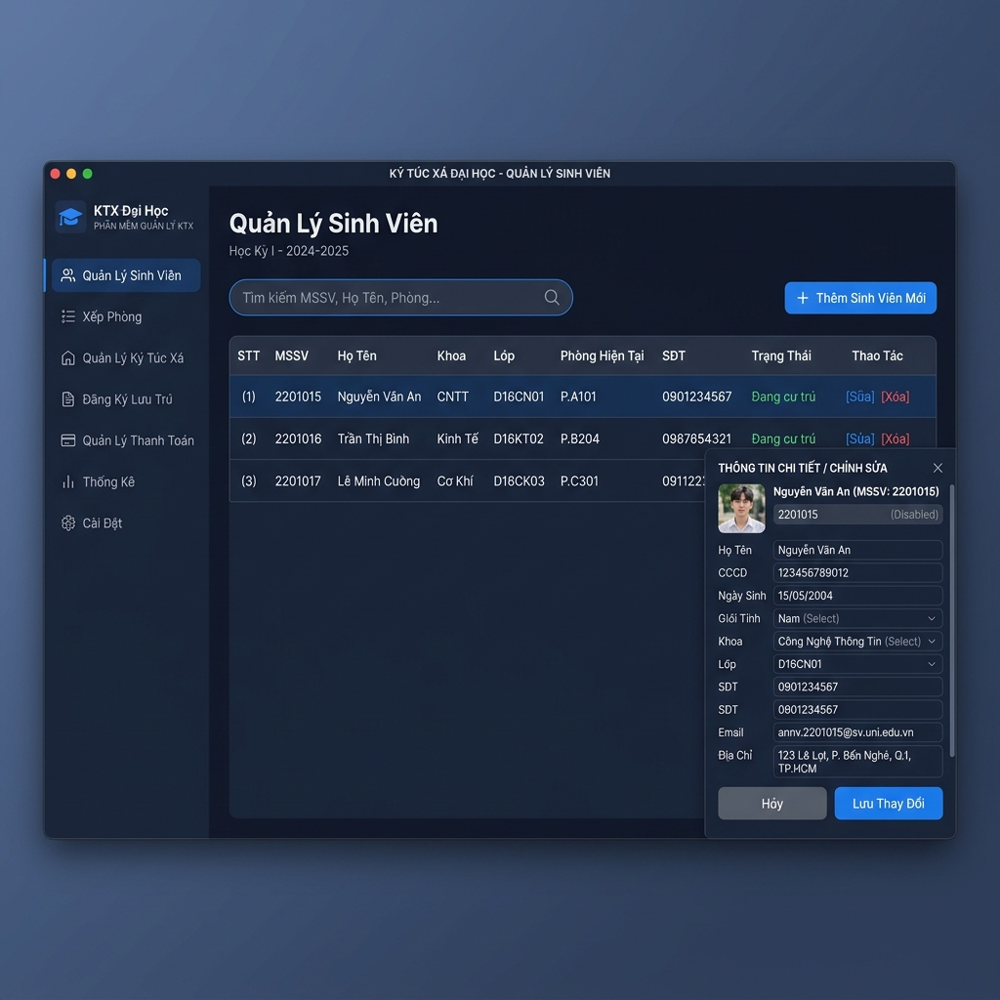
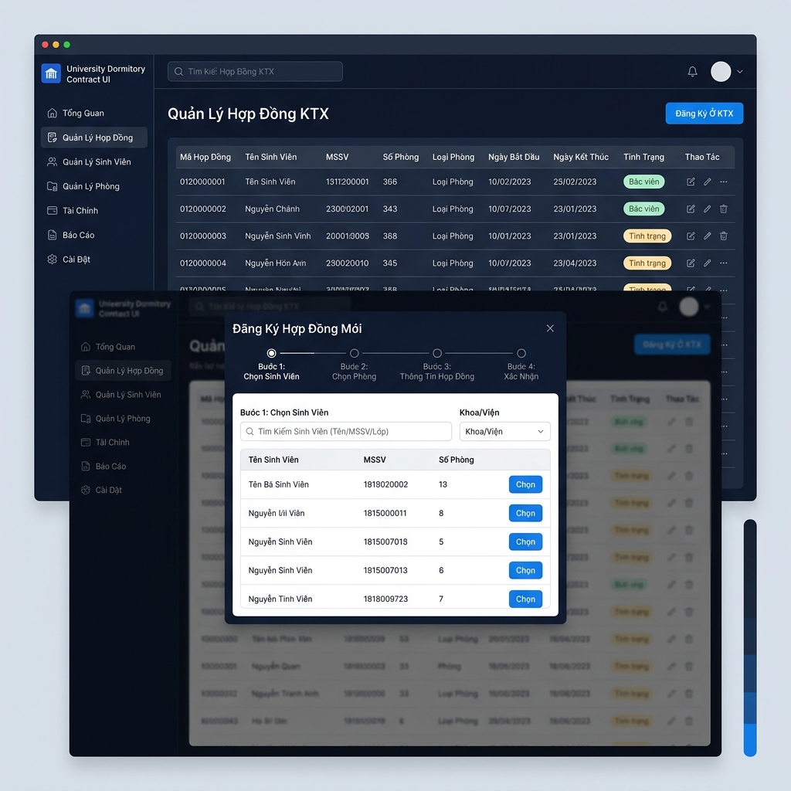

# 🏠 Hệ Thống Quản Lý Ký Túc Xá Trường Đại Học

<div align="center">


**Phần mềm quản lý ký túc xá dành cho trường đại học — Môn Lập Trình Python**

</div>

---

## 📋 Giới Thiệu

Phần mềm **Quản Lý Ký Túc Xá (KTX)** là ứng dụng desktop được xây dựng bằng Python, giúp ban quản lý KTX trường đại học tự động hóa và quản lý hiệu quả các hoạt động nghiệp vụ hàng ngày:

- Quản lý thông tin phòng ở và sinh viên
- Xử lý hợp đồng thuê phòng
- Thu phí điện, nước, dịch vụ hàng tháng
- Ghi nhận vi phạm nội quy
- Thống kê và báo cáo trực quan

## 🎯 Mục Tiêu Đề Tài

| Tiêu chí | Mô tả |
|---|---|
| **Môn học** | Lập Trình Python |
| **Loại ứng dụng** | Desktop Application |
| **Người dùng** | Nhân viên / Quản lý KTX Trường Đại Học |
| **Phạm vi** | Quản lý nghiệp vụ KTX: phòng, sinh viên, hợp đồng, thu phí |

---

## ✨ Chức Năng Chính

### 1. 🔐 Quản Lý Tài Khoản
- Đăng nhập / Đăng xuất bảo mật
- Phân quyền: **Admin** (toàn quyền) và **Nhân viên** (quyền hạn chế)
- Đổi mật khẩu

### 2. 📊 Dashboard Tổng Quan
- Thống kê nhanh: tổng phòng, phòng trống, số sinh viên, doanh thu tháng
- Biểu đồ doanh thu theo tháng
- Danh sách hoạt động gần nhất

### 3. 🏠 Quản Lý Phòng
- Thêm, sửa, xóa thông tin phòng
- Phân loại phòng: loại phòng (2/4/6 người), khu (A, B, C...), tầng
- Theo dõi trạng thái: **Trống** / **Đầy** / **Bảo trì**
- Xem danh sách sinh viên đang ở từng phòng

### 4. 👨‍🎓 Quản Lý Sinh Viên
- Quản lý hồ sơ: MSSV, họ tên, CCCD, khoa, lớp, liên lạc
- Tìm kiếm và lọc nhanh
- Xem lịch sử ở KTX của từng sinh viên

### 5. 📝 Quản Lý Hợp Đồng
- Đăng ký ở KTX theo dạng wizard từng bước
- Cấp phát giường cụ thể trong phòng
- Gia hạn hợp đồng, xử lý trả phòng
- Lưu lịch sử toàn bộ hợp đồng

### 6. 💰 Quản Lý Thu Phí
- Tạo phiếu thu hàng tháng (tiền phòng + điện + nước + dịch vụ)
- Ghi nhận thanh toán, theo dõi công nợ
- Cảnh báo sinh viên nợ phí quá hạn

### 7. ⚠️ Quản Lý Vi Phạm
- Ghi nhận vi phạm nội quy và mức phạt tương ứng
- Lịch sử vi phạm theo sinh viên
- Thống kê vi phạm theo loại

### 8. 📈 Báo Cáo & Thống Kê
- Báo cáo doanh thu theo tháng/quý/năm
- Danh sách phòng trống / sinh viên nợ phí
- Xuất báo cáo ra file CSV / PDF

---

## 🛠️ Công Nghệ Sử Dụng

| Thành phần | Công nghệ | Mục đích |
|---|---|---|
| Ngôn ngữ | Python 3.10+ | Core language |
| Giao diện | PySide6 (Qt6) | Desktop GUI |
| Cơ sở dữ liệu | SQLite 3 | Lưu trữ dữ liệu |
| Biểu đồ | Matplotlib | Dashboard charts |
| Xuất file | ReportLab + CSV | Xuất báo cáo |
| Bảo mật | bcrypt | Hash mật khẩu |

---

## 📁 Cấu Trúc Dự Án

```
ktx_manager/
├── main.py                    # Điểm khởi động ứng dụng
├── requirements.txt           # Danh sách thư viện
├── README.md                  # Tài liệu dự án
│
├── database/
│   ├── db.py                  # Kết nối & khởi tạo DB
│   └── schema.sql             # Cấu trúc database
│
├── models/                    # Business logic / Data models
│   ├── room.py                # Model phòng
│   ├── student.py             # Model sinh viên
│   ├── contract.py            # Model hợp đồng
│   ├── fee.py                 # Model phiếu thu phí
│   └── violation.py           # Model vi phạm
│
├── ui/                        # Giao diện người dùng
│   ├── main_window.py         # Cửa sổ chính (sidebar + routing)
│   ├── login.py               # Màn hình đăng nhập
│   ├── dashboard.py           # Trang tổng quan
│   ├── rooms.py               # Quản lý phòng
│   ├── students.py            # Quản lý sinh viên
│   ├── contracts.py           # Quản lý hợp đồng
│   ├── fees.py                # Quản lý thu phí
│   ├── violations.py          # Quản lý vi phạm
│   └── reports.py             # Báo cáo thống kê
│
├── utils/
│   ├── validators.py          # Kiểm tra dữ liệu đầu vào
│   └── helpers.py             # Các hàm tiện ích
│
├── assets/
│   └── style.qss              # Qt Stylesheet (Dark theme)
│
└── docs/                      # Tài liệu dự án
    ├── mo_ta_chuc_nang.md     # Mô tả chi tiết chức năng
    ├── database_schema.md     # Thiết kế cơ sở dữ liệu
    └── mockups/               # Mockup giao diện
        ├── 01_login.png
        ├── 02_dashboard.png
        ├── 03_quan_ly_phong.png
        ├── 04_quan_ly_sinh_vien.png
        ├── 05_quan_ly_hop_dong.png
        └── 06_quan_ly_thu_phi.png
```

---

## 🖼️ Giao Diện Phần Mềm (Mockup)

### Màn Hình Đăng Nhập


### Dashboard Tổng Quan


### Quản Lý Phòng


### Quản Lý Sinh Viên


### Quản Lý Hợp Đồng


### Quản Lý Thu Phí


---

## 🚀 Hướng Dẫn Cài Đặt

### Yêu Cầu Hệ Thống
- Python 3.10 trở lên
- Windows 10/11 (hoặc Linux/macOS)

### Các Bước Cài Đặt

```bash
# 1. Clone repository
git clone https://github.com/<username>/ktx-manager.git
cd ktx-manager

# 2. Tạo môi trường ảo
python -m venv venv
venv\Scripts\activate        # Windows
# source venv/bin/activate   # Linux/macOS

# 3. Cài đặt thư viện
pip install -r requirements.txt

# 4. Chạy ứng dụng
python main.py
```

### Tài Khoản Mặc Định
| Tài khoản | Mật khẩu | Quyền |
|---|---|---|
| `admin` | `admin123` | Quản trị viên |
| `nhanvien` | `123456` | Nhân viên |

---

## 📅 Kế Hoạch Phát Triển

| Tuần | Nội dung |
|---|---|
| **Tuần 1** ✅ | Mô tả chức năng, phác thảo giao diện (mockup), thiết kế database |
| **Tuần 2** | Xây dựng core: database, models, main window, login |
| **Tuần 3** | Module Quản lý Phòng + Sinh Viên |
| **Tuần 4** | Module Hợp đồng + Thu phí |
| **Tuần 5** | Vi phạm + Dashboard + Báo cáo |
| **Tuần 6** | Testing, hoàn thiện, viết báo cáo |

---

## 👥 Thành Viên Nhóm

| STT | Họ và Tên | MSSV | Vai trò |
|---|---|---|---|
| 1 | | | Trưởng nhóm |
| 2 | | | Thành viên |
| 3 | | | Thành viên |

---

## 📄 Giấy Phép

Dự án được phát triển cho mục đích học tập — Môn Lập Trình Python.

---

<div align="center">
  <sub>🏫 Trường Đại Học — Khoa Công Nghệ Thông Tin — Năm học 2025-2026</sub>
</div>
