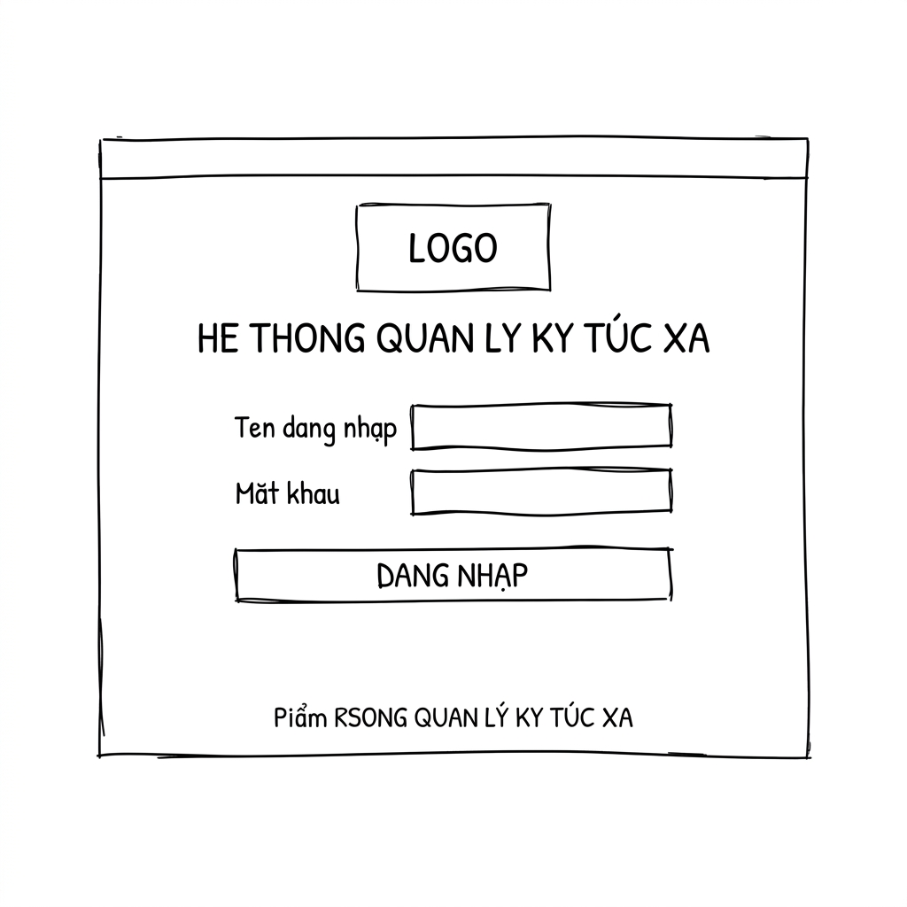
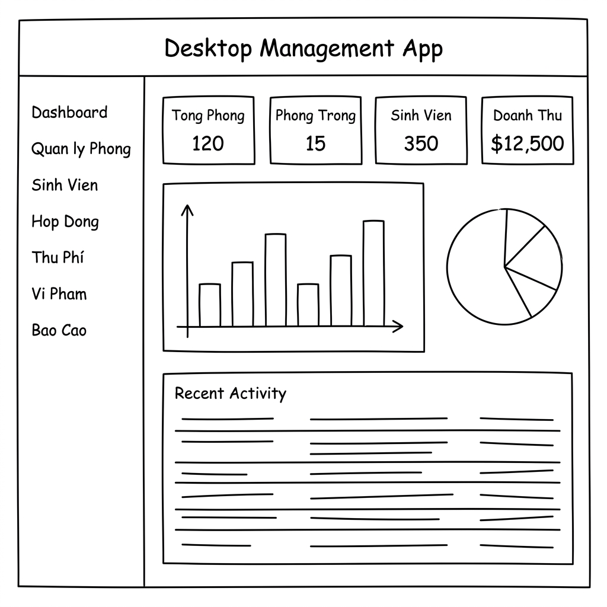
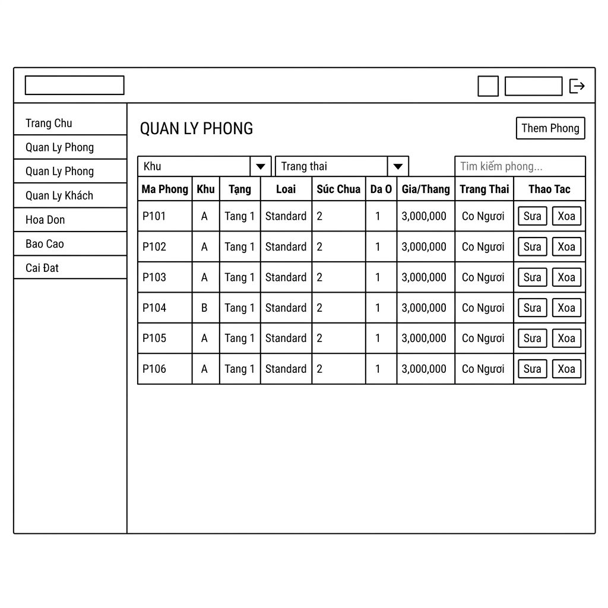
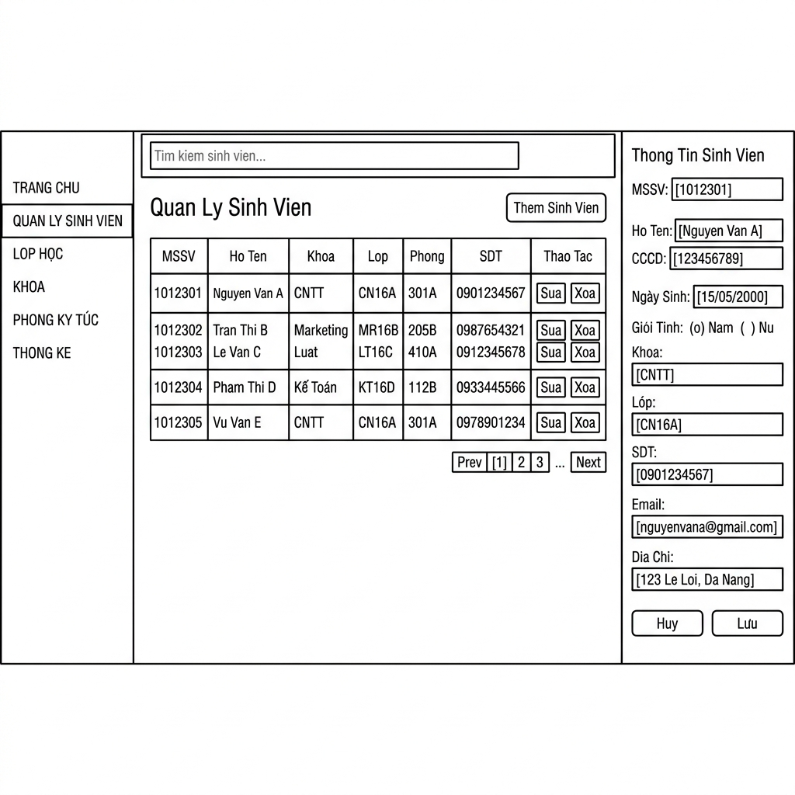
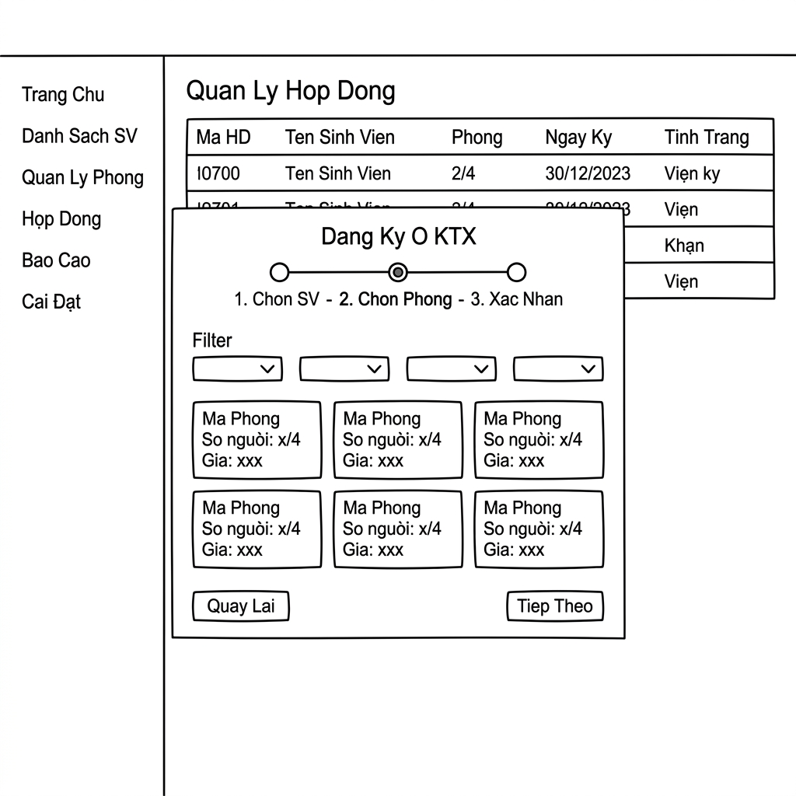
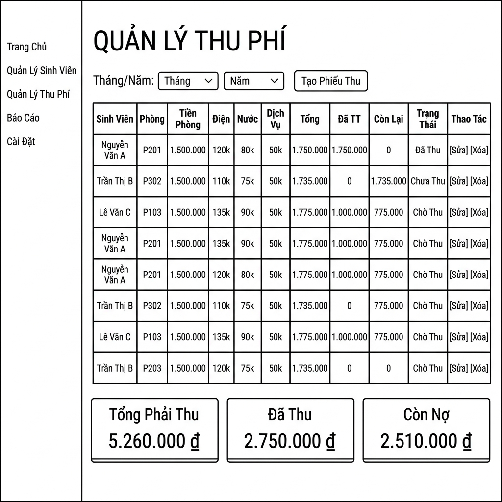

# Thiết Kế Giao Diện UI — Hệ Thống Quản Lý KTX

> **Phong cách:** Modern Dark Blue — Chuyên nghiệp, tối giản, dễ sử dụng  
> **Framework:** PySide6 (Qt6)  
> **Ngày thiết kế:** 14/04/2026

---

## 1. Design System

### 1.1 Bảng Màu (Color Palette)

| Tên | Mã màu | Dùng cho |
|---|---|---|
| Background chính | `#0F1724` | Nền toàn ứng dụng |
| Sidebar | `#1A2537` | Thanh điều hướng trái |
| Card/Panel | `#1E2D42` | Các khung nội dung |
| Border | `#2A3F5F` | Đường viền |
| **Accent Blue** | `#4A9EFF` | Màu nhấn chính, nút bấm |
| **Accent Teal** | `#00D4AA` | Màu nhấn phụ, số liệu |
| Text chính | `#E8EDF5` | Chữ nội dung |
| Text phụ | `#8899B4` | Chữ nhãn, placeholder |
| Success (xanh) | `#51CF66` | Trạng thái tốt, thành công |
| Warning (cam) | `#FFB347` | Cảnh báo |
| Danger (đỏ) | `#FF6B6B` | Lỗi, nguy hiểm |
| Hover | `#243552` | Hiệu ứng hover menu |

### 1.2 Typography

| Loại | Font | Kích thước | Weight |
|---|---|---|---|
| Tiêu đề lớn | Segoe UI | 24px | Bold (700) |
| Tiêu đề section | Segoe UI | 18px | SemiBold (600) |
| Nội dung | Segoe UI | 13px | Regular (400) |
| Nhãn form | Segoe UI | 12px | Medium (500) |
| Số liệu card | Segoe UI | 28px | Bold (700) |

### 1.3 Các Thành Phần UI Chung

**Button Styles:**
- `Primary` — Nền Accent Blue, chữ trắng → Hành động chính
- `Secondary` — Viền Accent Blue, nền trong suốt → Hành động phụ
- `Danger` — Nền Danger Red → Xóa, hủy bỏ
- `Ghost` — Không viền, chữ xanh nhạt → Ít quan trọng

**Status Badge:**
- 🟢 `Trống` / `Đang hiệu lực` / `Đã TT` — Màu Success
- 🔴 `Đầy` / `Chưa TT` / `Kết thúc` — Màu Danger
- 🟡 `Bảo trì` / `TT 1 phần` — Màu Warning

---

## 2. Layout Tổng Quát

```
┌──────────────────────────────────────────────────────────┐
│  HEADER: Logo | Tên hệ thống     [User] [Đăng xuất]     │
├─────────────┬────────────────────────────────────────────┤
│             │                                            │
│  SIDEBAR    │           CONTENT AREA                     │
│             │                                            │
│  📊 Dashboard│   ┌─────────────────────────────────────┐ │
│  🏠 Phòng   │   │  Page Title + Action Buttons         │ │
│  👤 Sinh viên│   ├─────────────────────────────────────┤ │
│  📝 Hợp đồng│   │                                     │ │
│  💰 Thu phí │   │         MAIN CONTENT                │ │
│  ⚠️ Vi phạm │   │    (Table / Form / Charts)          │ │
│  📈 Báo cáo │   │                                     │ │
│  ⚙️ Cài đặt │   └─────────────────────────────────────┘ │
│             │                                            │
└─────────────┴────────────────────────────────────────────┘
```

**Kích thước:**
- Cửa sổ: 1280 × 800px (minimum), resizable
- Sidebar: 220px (cố định)
- Header: 60px

---

## 3. Thiết Kế Từng Màn Hình

---

### Màn Hình 1: Đăng Nhập (Login)



**Mô tả:** Màn hình toàn màn hình, không có sidebar.

```
┌──────────────────────────────┐
│                              │
│    🏛️  [Logo Trường]        │
│                              │
│  HỆ THỐNG QUẢN LÝ KTX       │
│  Ký Túc Xá - Trường ĐH      │
│                              │
│  ┌────────────────────────┐  │
│  │ 👤  Tên đăng nhập      │  │
│  └────────────────────────┘  │
│  ┌────────────────────────┐  │
│  │ 🔒  Mật khẩu          │  │
│  └────────────────────────┘  │
│                              │
│  [      ĐĂNG NHẬP      ]    │
│                              │
│  © 2026 Ban Quản Lý KTX     │
└──────────────────────────────┘
```

**Hành vi:**
- Nhấn Enter để đăng nhập
- Hiển thị lỗi inline nếu sai tài khoản
- Animation fade-in khi tải trang

---

### Màn Hình 2: Dashboard



**Vùng nội dung gồm:**

**Row 1 — Summary Cards (4 thẻ):**
```
┌──────────┐ ┌──────────┐ ┌──────────┐ ┌──────────┐
│ 🏠       │ │ ✅       │ │ 👥       │ │ 💰       │
│ 120      │ │ 24       │ │ 368      │ │ 45.2M    │
│ Tổng Phòng│ │Phòng Trống│ │ Sinh Viên│ │Doanh Thu │
└──────────┘ └──────────┘ └──────────┘ └──────────┘
```

**Row 2 — Charts:**
- Cột trái (60%): Biểu đồ cột doanh thu 6 tháng
- Cột phải (40%): Biểu đồ tròn tỷ lệ phòng

**Row 3 — Recent Activity:**
- Danh sách 10 hoạt động gần nhất (icon + mô tả + thời gian)

---

### Màn Hình 3: Quản Lý Phòng



**Layout:**
```
[Tiêu đề] Quản Lý Phòng          [+ Thêm Phòng]
─────────────────────────────────────────────────
[Khu: All ▼] [Trạng thái: All ▼]  [🔍 Tìm kiếm...]

Mã Phòng | Khu | Tầng | Loại | Sức Chứa | Đã Ở | Giá/Tháng | Trạng Thái | Thao Tác
─────────────────────────────────────────────────────────────────────────────────────
A101     |  A  |  1   |  4N  |    4     |   4  | 500,000₫  | [Đầy]      | [✏️][🗑️]
A102     |  A  |  1   |  4N  |    4     |   2  | 500,000₫  | [Trống]    | [✏️][🗑️]
B201     |  B  |  2   |  6N  |    6     |   0  | 400,000₫  | [Trống]    | [✏️][🗑️]
```

**Dialog Thêm/Sửa Phòng:**
```
┌─────────────────────────────────────┐
│  Thêm Phòng Mới                 [X] │
├─────────────────────────────────────┤
│  Mã phòng*    [A___________]        │
│  Khu nhà*     [A ▼]                 │
│  Tầng*        [1 ▼]                 │
│  Sức chứa*    [4 người ▼]           │
│  Giá/tháng*   [___________] VNĐ     │
│  Mô tả        [___________________] │
│                                     │
│           [Hủy]  [Lưu Phòng]       │
└─────────────────────────────────────┘
```

---

### Màn Hình 4: Quản Lý Sinh Viên



**Layout:** Bảng danh sách + Panel chi tiết (slide từ phải)

```
[Tiêu đề] Quản Lý Sinh Viên       [+ Thêm Sinh Viên]
─────────────────────────────────────────────────────
[🔍 Tìm theo MSSV hoặc tên...]   [Khoa: All ▼]

MSSV      | Họ Tên          | Khoa  | Lớp   | Phòng  | SĐT          | Thao Tác
──────────────────────────────────────────────────────────────────────────────
SV001234  | Nguyễn Văn An   | CNTT  | CNTT1 | A101   | 0912345678   | [👁️][✏️][🗑️]
SV001235  | Trần Thị Bình   | KT    | KT02  | B203   | 0987654321   | [👁️][✏️][🗑️]
```

---

### Màn Hình 5: Quản Lý Hợp Đồng



**Wizard Đăng Ký Ở KTX (Dialog đa bước):**
```
[●────────●────────●]
Chọn SV   Chọn Phòng  Xác Nhận

─── BƯỚC 2: CHỌN PHÒNG ───────────────────
[Lọc: Khu A ▼] [4 người ▼]

  ┌─────────┐  ┌─────────┐  ┌─────────┐
  │  A102   │  │  A103   │  │  C101   │
  │  4 người│  │  4 người│  │  6 người│
  │  2 trống│  │  3 trống│  │  5 trống│
  │ 500,000₫│  │ 500,000₫│  │ 400,000₫│
  │ [Chọn] │  │ [Chọn] │  │ [Chọn] │
  └─────────┘  └─────────┘  └─────────┘

[← Quay Lại]              [Tiếp Theo →]
```

---

### Màn Hình 6: Quản Lý Thu Phí



**Layout:**
```
[Tiêu đề] Quản Lý Thu Phí     [Tháng: 04/2026 ▼]  [+ Tạo Phiếu]
──────────────────────────────────────────────────────────────────
[Trạng thái: All ▼]  [🔍 Tìm sinh viên...]

Sinh Viên   | Phòng | Tiền Phòng | Điện  | Nước | Tổng    | Đã TT  | Còn Lại | TT
─────────────────────────────────────────────────────────────────────────────────
Nguyễn V. A | A101  | 500,000₫   | 85,000│45,000│ 630,000₫│ 630,000│    0    │✅
Trần Thị B  | B203  | 400,000₫   | 65,000│38,000│ 503,000₫│       0│503,000  │🔴

─── Tổng kết tháng ─────────────────────────
  Tổng phải thu: 25,450,000₫
  Đã thu:        18,320,000₫  
  Còn nợ:         7,130,000₫
```

---

### Màn Hình 7: Quản Lý Vi Phạm

**Layout:**
```
[Tiêu đề] Quản Lý Vi Phạm        [+ Ghi Nhận Vi Phạm]
──────────────────────────────────────────────────────
[🔍 Tìm sinh viên...]  [Loại VP: All ▼]  [Từ ngày...→ Đến ngày...]

Sinh Viên   | Loại Vi Phạm        | Ngày VP    | Mức Phạt | Trạng Thái | #
─────────────────────────────────────────────────────────────────────────
Nguyễn V. C | Về trễ giờ quy định | 12/04/2026 |  50,000₫ | [Chưa nộp] | ✏️
Lê Văn D    | Gây ồn ào sau 22h   | 10/04/2026 | 100,000₫ | [Đã nộp]   | ✏️
```

---

### Màn Hình 8: Báo Cáo

**Layout:**
```
[Tiêu đề] Báo Cáo & Thống Kê

Tab: [Doanh Thu] [Công Suất] [Công Nợ]

─── DOANH THU THEO THÁNG ─────────────────────
Năm: [2026 ▼]

    ███                               
    ███  ███                          
    ███  ███  ███  ███  ███           
    ███  ███  ███  ███  ███  ███      
── ──── ──── ──── ──── ──── ────  ──
   T1   T2   T3   T4   T5   T6

                            [Xuất CSV] [Xuất PDF]
```

---

## 4. Nguyên Tắc UX

| Nguyên tắc | Áp dụng |
|---|---|
| **Consistency** | Cùng kiểu button, table, form trên toàn hệ thống |
| **Feedback** | Toast notification sau mỗi thao tác thành công/lỗi |
| **Confirmation** | Dialog xác nhận trước khi xóa/kết thúc HĐ |
| **Validation** | Kiểm tra dữ liệu ngay khi nhập (inline error) |
| **Empty State** | Hiển thị icon + text khi danh sách rỗng |
| **Loading** | Spinner khi tải dữ liệu nặng |
